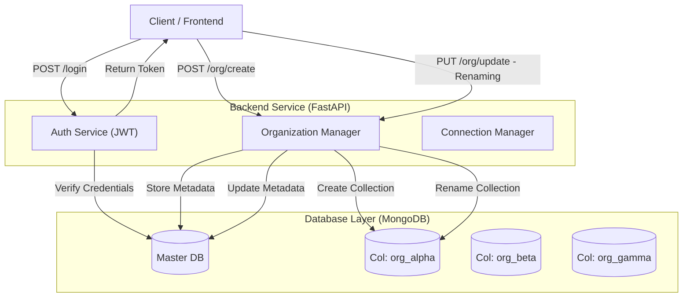

# Multi Tenant App

1.  **Install requirements:**
    ```bash
    pip install -r requirements.txt
    ```
2.  **Start MongoDB:** Ensure you have a MongoDB instance running locally on port 27017.
3.  **Run the App:**
    ```bash
    uvicorn app.main:app --reload
    ```
4.  **Access Documentation:**
    Go to `http://127.0.0.1:8000/docs` to test APIs interactively.

---

### 5. Architectural Diagram



---

### 6. Architecture Analysis & Trade-offs

**Is this a scalable design?**
It is a **moderately scalable** design suitable for startups and SaaS applications with small to medium-sized tenants, but it faces limits at very high scale.

**Trade-offs & Design Choices:**

1.  **Collection per Tenant (Current Approach):**

    - _Pros:_ Good logical isolation. Easy to "offboard" a client (just drop collection). Data queries are simple (no need to filter every query by `tenant_id`).
    - _Cons:_ MongoDB has a namespace limit (approx 24,000 namespaces/collections per database depending on storage engine configuration). Having 100,000 tenants would break this. It also consumes more RAM for index overhead across many collections.

2.  **Database per Tenant:**

    - _Pros:_ Perfect isolation (security). Can move specific tenants to different physical servers easily.
    - _Cons:_ High resource overhead (file descriptors). Managing connections in code becomes complex (connection pools per tenant).

3.  **Single Collection with `tenant_id`:**
    - _Pros:_ Infinite scalability regarding tenant count. Very efficient resource usage.
    - _Cons:_ Strict developer discipline required (forgetting `WHERE tenant_id=X` leaks data). Data cleanup/deletion is slower (delete many rows vs drop collection).
